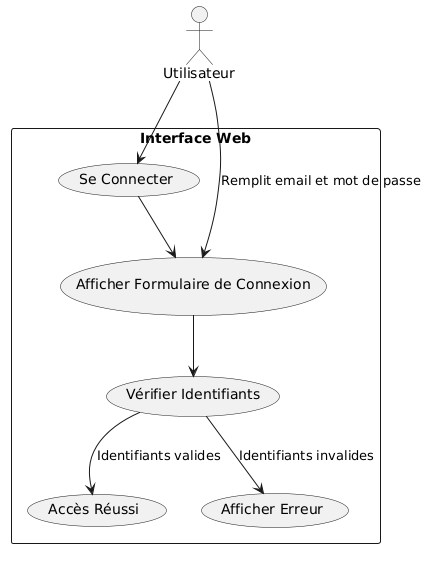
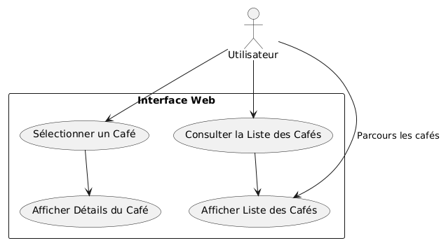
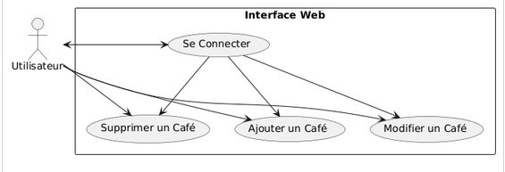
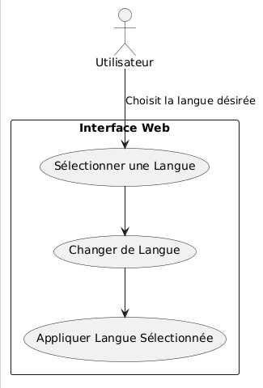

# Documentation Technique EMCAFFE
:toc:
:toc-title: Table des matières
:sectnums:

----

Version : 1
Date : 09/2024
Equipe : 2B Rouge
Auteurs : Julien Bizet / Rouquié Yann / Katbie Mathéo / Thomas Cossic / Maël Carrié / Tom Meyer / Antoine Leboucher
Projet : Développement du site Web pour l'entreprise EMCAFFE

----

== Présentation de l'Application

Le projet EMCAFFE consiste à développer un site web pour l'entreprise EMCAFFE afin de promouvoir les différents cafés proposés par l'entreprise.
L'application web permettra aux utilisateurs de consulter les différents cafés proposés par l'entreprise.

Le principal utilisateur de l'application est la gérante de l'entreprise EMCAFFE. Elle pourra gérer les différents cafés proposés par l'entreprise.

Les fonctionnalités détaillées sont les suivantes :

    - L'utilisateur pourra ajouter des cafés directement depuis l'application web par le front.

    - L'utilisateur pourra supprimer des cafés directement depuis l'application web par le front.

    - L'utilisateur pourra modifier des cafés directement depuis l'application web par le front.

    - L'utilisateur pourra consulter les différents cafés proposés par l'entreprise.

    - L'utilisateur pourra modifier la langue de l'application web.

== Prérequis

=== Logiciels & comptes requis

Avant de commencer à utiliser l'application web, assurez-vous d'avoir les éléments suivants :

 - Une connexion internet.
 - Un navigateur web (Google Chrome, Mozilla Firefox, Microsoft Edge...).

=== Configurations systèmes requis

Pour garantir des performances optimales, voici les configurations système recommandées pour l'application web :

- Système d'exploitation : Windows 10/11 (ou macOS Big Sur 11.4 ou version ultérieure)
- Mémoire RAM : 4 Go de RAM (8 Go recommandés)
- Espace de stockage disponible : Entre 5 Go et 10 Go d'espace disque disponible
- Processeur : ARM64 ou x64, Quad-core (ou mieux recommandé)
- Connexion : Connexion Internet.

== Architecture

=== Architecture du projet

Le projet EMCAFFE est composé de deux parties principales :

 - Une partie Front-end développée en React.
 - Une base de données Supabase.

=== Technologies Utilisées

L'application repose sur les technologies suivantes :

- *React* : Utilisé pour la partie Front de l'application web.
- *VIte* : Utilisé pour le build et le serveur local.
- *Supabase* : Utilisé pour la base de données.
- *Cypress* : Utilisé pour les tests d'intégration.

=== Structuration du code

L'application est organisée selon la structure suivante :

- Dossier `Communication` : Contient les ordres du jour et les bilans des réunions.
- Dossier `Documentations` : Contient le cahier de recettes, la documentation Scrum, la documentation technique et la documentation utilisateur ainsi que la maquette et autres documentations utiles pour le projet.
- Dossier `emcaffe` : Contient le code source de l'application web.
- Dossier `Images` : Contient les images utilisées dans la documentation.

==== Prérequis

Avant de commencer, assurez-vous d'avoir installé les outils suivants :

- Disposer d'un ordinateur avec un système d'exploitation Windows, Linux ou MacOS.
- Avoir une connexion internet.
- Avoir installé un navigateur web (Google Chrome, Mozilla Firefox, Microsoft Edge...).

== Fonctionnalité - Pouvoir se connecter en tant qu'administrateur

=== Use Case

Dans cette fonctionnalité, l'utilisateur à la possibilité de se connecter en tant qu'administrateur pour accéder aux modifications du site web.
Scénario principal : +

   1 - L'utilisateur va sur le site web.
   2 - L'utilisateur se connecte en remplissant le formulaire de connexion.
   3 - L'utilisateur se déconnecte en cliquant sur le bouton déconnexion dans la barre de navigation latérale.

Interactions avec le système : +

* L'utilisateur utilise l'interface login de l'application pour accéder à la page de gestion du site web.
* L'application vérifie la validité des données de connexion saisies par l'utilisateur.
* L'application crée un cookie dans le navigateur de l'utilisateur pour confirmer la connexion. Sinon un message d'erreur s'affiche.

=== Composants impliqués

== Fonctionnalité - Consulter les différents cafés proposés par l'entreprise

=== Use Case

Dans cette fonctionnalité, l'utilisateur à la possibilité de consulter les différents cafés proposés par l'entreprise.

Scénario principal : +

   1 - L'utilisateur se connecte sur le site web.
   2 - L'utilisateur clique sur l'onglet produit.
   3 - L'utilisateur peut apercevoir directement les différents cafés.

Interactions avec le système : +

* L'utilisateur utilise l'interface utilisateur du système pour accéder à la page de présentation des cafés.
* Le système récupère les informations des cafés.

=== Composants impliqués

== Fonctionnalité - L'utilisateur peut modifier les articles du site web.

=== Use Case

Dans cette fonctionnalité, l'utilisateur a la possibilité de modifier les articles du site web.

Scénario principal : +

   1 - L'utilisateur se connecte et s'authentifie sur le site web sur la page /login.
   2 - L'utilisateur clique sur l'icone de modification de l'article.
   3 - L'utilisateur peut ensuite modifier l'article et enregistrer les modifications.

=== Composants impliqués

== Fonctionnalité - L'utilisateur peut ajouter les articles du site web.

=== Use Case

Dans cette fonctionnalité, l'utilisateur a la possibilité d'ajouter les articles au site web.

Scénario principal : +

   1 - L'utilisateur se connecte et s'authentifie sur le site web sur la page /login.
   2 - L'utilisateur clique sur "Ajouter un produit".
    3 - L'utilisateur peut ensuite renseigner les informations sure le formulaire d'ajout d'aticles et enregistrer les modifications.

=== Composants impliqués

== Fonctionnalité - L'utilisateur peut supprimer les articles du site web.

=== Use Case

Dans cette fonctionnalité, l'utilisateur à la possibilité de supprimer les articles du site web.

Scénario principal : +

   1 - L'utilisateur se connecte et s'authentifie sur le site web sur la page /login.
   2 - L'utilisateur clique sur l'icone de suppréssion de l'article.
   3 - L'utilisateur peut ensuite supprimer l'article en cliquant sur la fenêtre modal de confirmation.

=== Composants impliqués

== Fonctionnalités - L'utilisateur peut changer la langue de l'application web

=== Use Case

Scénario principal : +

   1 - L'utilisateur se connecte sur le site web.
   2 - L'utilisateur clique sur le bouton paramètres de la barre de navigation.
   3 - L'utilisateur choisit la langue qu'il souhaite avec la liste déroulante et valide son choix.

Interactions avec le système : +

* L'utilisateur utilise le système pour accéder à la barre de navigation, puis aux paramètres pour modifier la langue.
* Le système prend en compte le changement de langue.
* Le système créé un cookie pour sauvegarder la langue choisie par l'utilisateur.
* Le système recharge la page pour appliquer le changement de langue.

=== Composants impliqués

