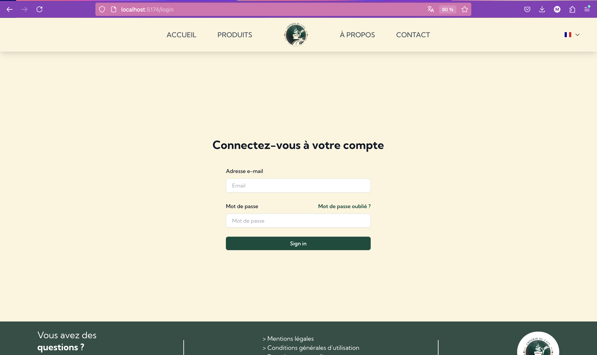
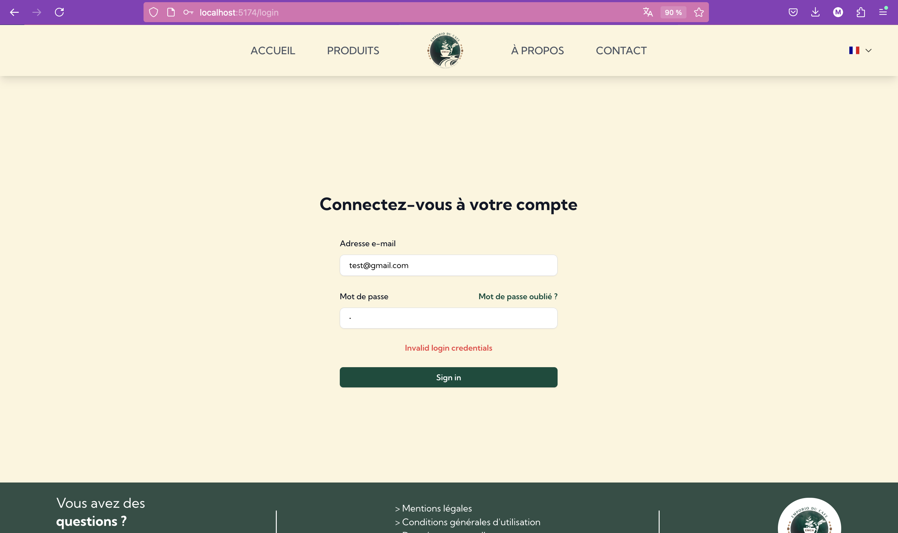
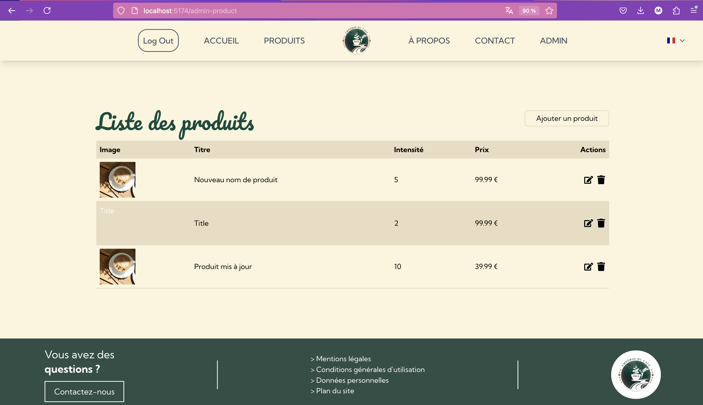
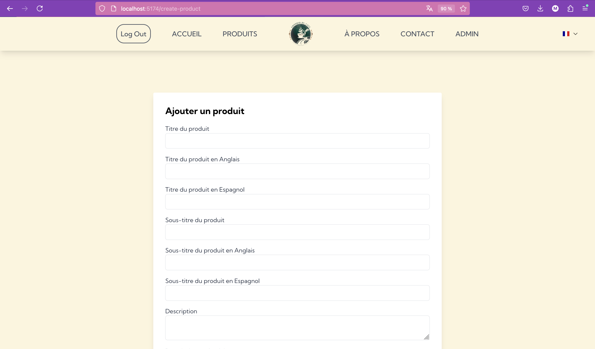
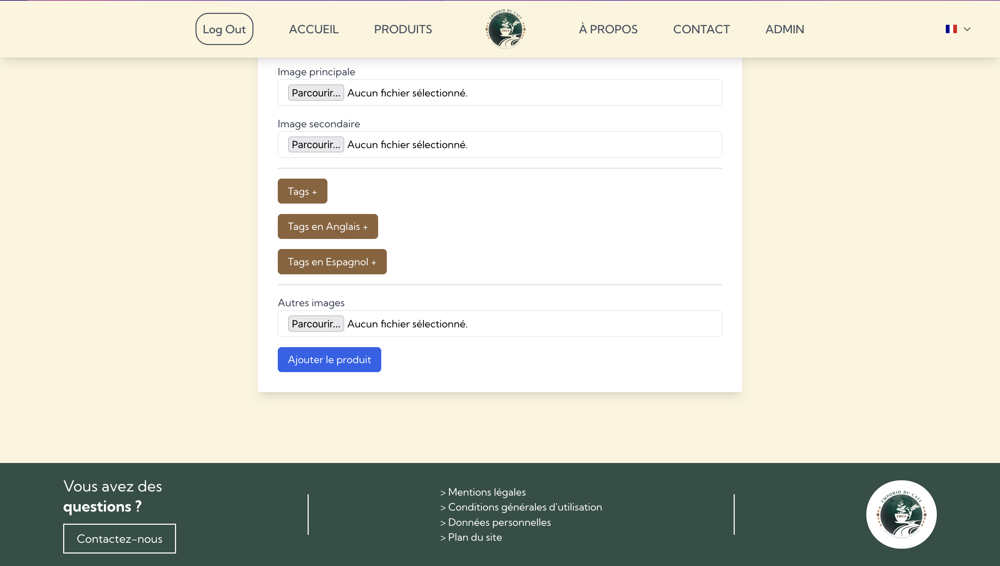
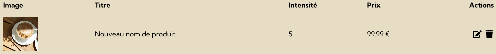
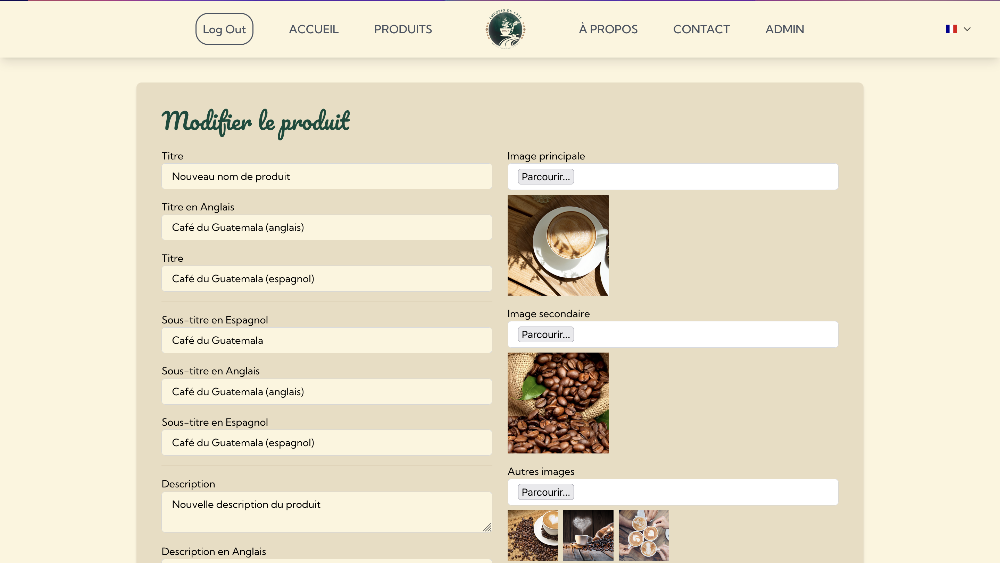
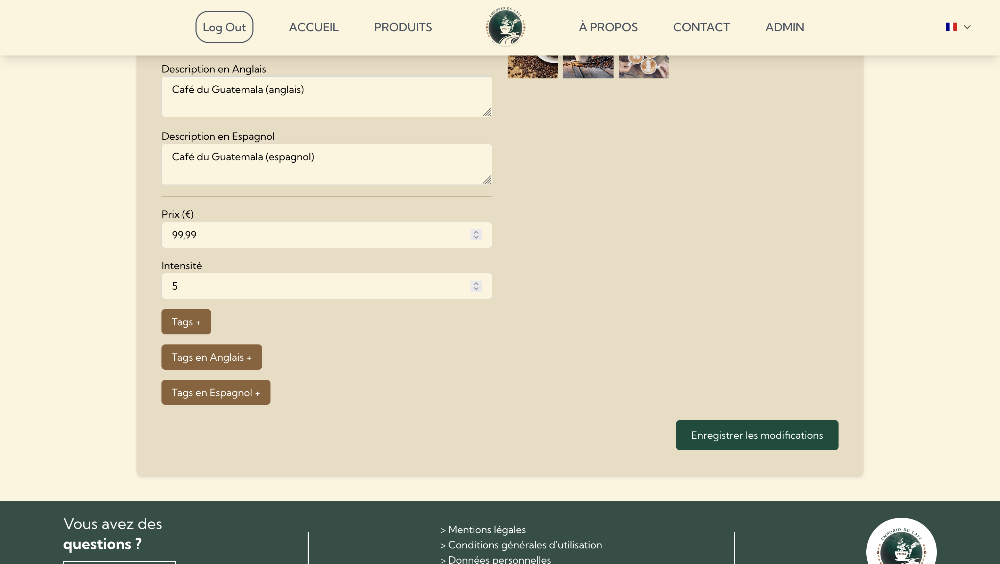

= Documentation Utilisateur EMCAFFE
:toc:
:toc-title: Table des matières
:sectnums:

----

Version : 2
Date : 09/2024
Equipe : EMCAFFE Rouge 2b
Auteurs : Maël Carrié / Yann Rouquié / Julien Bizet / Thomas Cossic / Mathéo Katbie Mathéo / Antoine Leboucher / Tom Meyer
Projet : Développement d'un site web vitrine pour l'entreprise EMCAFFE

----

== Présentation du projet

=== Présentation générale

Le projet consiste à développer un site vitrine pour l’entreprise EMCAFFE, spécialisée dans la vente de café haut de gamme. L’objectif principal est de promouvoir l’activité de l’entreprise sur internet, en mettant en avant la qualité exceptionnelle.

Le site vitrine offrira une expérience utilisateur intuitive et immersive, permettant aux visiteurs de découvrir l’histoire d’EMCAFFE, les différentes variétés de café proposées, ainsi que les valeurs de l’entreprise. Les sections du site incluront une présentation détaillée des produits et des informations sur l’origine des cafés.

Le développement du site repose sur des technologies web modernes telles que react, avec un back-end basé sur supabase pour une gestion facile des mises à jour de contenu par l’équipe d’EMCAFFE. Un soin particulier sera apporté au design, qui reflétera l’identité visuelle de la marque et sa passion pour le café.

Ce projet vise non seulement à augmenter la notoriété d’EMCAFFE sur internet, mais aussi à renforcer la relation entre la marque et ses clients, en offrant une plateforme où la qualité et l’authenticité du café d’EMCAFFE peuvent être pleinement appréciées.

=== Rôle du site web

Le site résultant de ce projet permettra à EMCAFFE de présenter et de promouvoir ses produits de café auprès d’un public large sur internet. Les fonctionnalités clés incluront une présentation détaillée des variétés de café proposées et l'histoire de l'entreprise.

==  Utilisation

=== Pré-requis
|===
| Navigateur |
- Compatible avec les dernières versions de Chrome, Firefox, Safari, ou Edge.
|===

=== Utilisation

Pour utiliser le site web, accédez simplement à l'interface web via le lien mis en place précédement. Connectez-vous avec les identifiants qui vous sont fournis et explorez les fonctionnalités offertes par l'interface.

NOTE: La section suivante fournit une vue d'ensemble des fonctionnalités du site web et guide les utilisateurs à travers une fonctionnalité clé. Explorez les autres sections de la documentation pour découvrir toutes les capacités offertes par le site web.

== Fonctionnement du site web

Lorsque vous accédez au site, vous découvrirez une variété de fonctionnalités conçues pour vous aider à gérer efficacement la vitrine en ligne de l’entreprise.

Dès votre arrivée sur le site, vous êtes accueilli sur la page principale, où l’interface intuitive vous guide à travers les différentes options disponibles. Pour accéder aux fonctionnalités avancées, vous pouvez vous connecter en utilisant l’icône de connexion située en haut à droite de la page. Après avoir cliqué sur cette icône, il vous suffira d’entrer votre identifiant et votre mot de passe pour accéder à votre compte.

Une fois connecté, vous serez redirigé vers la page d’accueil, mais avec l’accès à des fonctionnalités supplémentaires, telles que l’ajout, la modification, et la gestion des produits en vente. L’interface utilisateur est conçue pour être simple et efficace, permettant un accès rapide aux différentes fonctionnalités via des boutons bien placés et clairement identifiables.

Le site web est conçu pour mettre en avant l’entreprise ainsi que les produits disponibles à la vente, tout en offrant une interface de gestion complète pour ces produits. Vous pouvez facilement ajouter de nouveaux articles, mettre à jour les informations des produits existants, ou retirer des produits de la vitrine selon les besoins de l’entreprise.

Il est important de noter que la seule utilisatrice de ce site est la responsable du magasin, qui dispose de l’autorité nécessaire pour gérer l’ensemble des produits et maintenir le site à jour.

Maintenant, explorons en détail les fonctionnalités spécifiques mises à disposition de l’utilisatrice, en mettant un accent particulier sur celles liées à la gestion des produits en vente.

=== Fonctionnalités disponibles

==== Pouvoir se connecter et se déconnecter

Pour effectuer cette action, il vous faut accéder au site. Ensuite, il vous faut rajouter dans le lien "/login".

Une fois sur cette page, vous pouvez vous connecter en tant qu'administrateur en remplissant les champs de connexion.

Si vous saisissez les bonnes informations, vous serez redirigé vers la page d'accueil.

image:../images/connexion3.png[Page de connexion, 600, 400]

Sinon, un message d'erreur va s'afficher et vous devrez corriger vos informations.

Maintenant, pour vous déconnecter du site web, vous devez cliquer sur le bouton "Log Out" en haut à gauche de la navbar.

image:../images/connexion3.png[Page de connexion, 600, 400]

Cela va vous déconnecter et vous ramener à la page d'accueil.

image:../images/connexion4.png[Page de connexion, 600, 400]

Cette fonctionnalité permet au propriétaire du site web de se connecter en tant qu'administrateur et aussi de se déconnecter. Cela ajoute une sécurité au site et permet aussi à l'administrateur de faire les prochaines fonctionnalités.

==== Pouvoir ajouter un produit

Pour effectuer cette action, il vous faut être sur le site web et vous devez être connecté en tant qu'administrateur. Ensuite, vous devez accéder à l'onglet de gestion des produits, en cliquant sur l'onglet "Admin" dans la navbar.

image:../images/connexion3.png[Connexion, 600, 400]

Ensuite, vous arrivez sur la page de gestion des produits.

Une fois sur cette page, il vous suffit de cliquer sur le bouton "Ajouter un produit".

Une fois cliqué, vous arrivez sur un formulaire d'ajout de produit.

Vous devez maintenant compléter le formulaire en ajoutant aussi les images produits et les traductions. 

Une fois les champs validées, vous n'avez plus qu'à cliquer sur le bouton "Ajouter le produit".

Une fois cliqué, vous êtes redirigé vers la page admin où vous pouvez voir que le produit à bien été ajouté.
Cette fonctionnalité permet à l'administrateur d'ajouter un produit de son site vitrine.

==== Pouvoir retirer un produit 

Pour effectuer cette action, il vous faut être sur le site web et vous devez être connecté en tant qu'administrateur. Ensuite, vous devez accéder à l'onglet de gestion des produits, en cliquant sur l'onglet "Admin" dans la navbar.

image:../images/connexion3.png[Connexion, 600, 400]

Ensuite, vous avez un visuel sur tout les produits mis en avant sur le site web. 

Pour retirer un produit, vous devez cliquer sur la poubelle qui se trouve dans la colonne "Action".

Une fois cette poubelle cliqué, vous avez retirer le produit du site web.

Cette fonctionnalité permet à l'administrateur de retirer un produit de son site vitrine.

==== Pouvoir modifier un produit

Pour effectuer cette action, il vous faut être sur le site web et vous devez être connecté en tant qu'administrateur. Ensuite, vous devez accéder à l'onglet de gestion des produits, en cliquant sur l'onglet "Admin" dans la navbar.

image:../images/connexion3.png[Connexion, 600, 400]

Ensuite, vous avez un visuel sur tout les produits mis en avant sur le site web. 

Pour modifier un produit, vous devez cliquer sur le crayon qui se trouve dans la colonne "Action".

Vous arrivez ensuite sur le formulaire avec les champs du produit.

Vous pouvez maintenant modifier les champs du produits et cliquer sur le bouton "Enregistrer les modifications" en bas du formulaire.

Une fois le bouton cliqué, vous avez modifié le produit et vous avez été redirigé vers la liste des produits.

Cette fonctionnalité permet à l'administrateur de garder à jour un produit sur le site vitrine.

